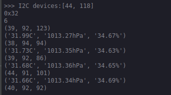

# SP_Weather Module User Guide

[中文](README_CN.md)

## Directory Structure
| Directory | Description                                   |
| :-------: | :-------------------------------------------- |
|    doc    | Reference documentation                       |
|    img    | Images                                        |
|  script   | Maixpy script example                         |
|    src    | C program example based on the standalone sdk |

## Introduce

SP_Weather has two sensors, magnetic sensor QMC7983, which is a triaxial magnetic sensor with built-in sensitivity compensation and NTC, use I2C to output (up to 400KHz) with excellent dynamic range and precision as well as ultra-low power consumption. The temperature, humidity and barometric pressure sensor BME280 can simultaneously measure temperature, humidity and barometric pressure. The data of the two sensors can be read according to their different device addresses.

*See [Specification](doc/SP-WEATHER规格书V1.0.pdf) for more information*

## Pin figure


## Mode connection


|  MCU:FUN(IO)  | SP_Weather |
| :-----------: | :--------: |
| I2C:SDA(IO_7) |    SDA     |
|   NC(IO_15)   |     NC     |
|   NC(IO_20)   |     NC     |
|   NC(IO_21)   |     NC     |
|   NC(IO_8)    |     NC     |
| I2C:SCL(IO_6) |    SCL     |
|     3.3V      |    3.3V    |
|      GND      |    GND     |

## MCU configuration

### IO port configuration

The corresponding IO port in the MCU schematic diagram is configured as I2C function pin.

* C

  ```c
    fpioa_set_function(WEATHER_SCL, FUNC_I2C0_SCLK + WEATHER_I2C_DEVICE * 2); // WEATHER_SCL: 6;
    fpioa_set_function(WEATHER_SDA, FUNC_I2C0_SDA + WEATHER_I2C_DEVICE * 2); // WEATHER_SDA: 7;
  ```

* MaixPy

    Configure in I2C initialization

### I2C initialization

* C

  ```c
    maix_i2c_init(WEATHER_I2C_DEVICE, 7, 400000); // WEATHER_I2C_DEVICE: 0;
  ```

* MaixPy

  ```python
    i2c_bus = I2C(I2C.I2C0, freq=100*1000, scl=6, sda=7) # scl: io_6, sda: io_7
  ```

## SP_Weather configuration

### Usage

* Process

  1. Initializing sensor
  2. Read sensor data

* C

  ```c
    rslt = qmc_init(); // Magnetic sensor QMC7983 init 
    rslt = bme280_init(&dev); // Temperature, humidity and pressure sensors BME280 init 
    stream_sensor_data_normal_mode(&dev); // read and print sensor data
  ```
  
* MaixPy

  ```python
    weather=SPWEATHER(i2c=i2c_bus) # create sp_weather
    weather.qmc_init() # Magnetic sensor QMC7983 init 
    weather.bme280_init() # Temperature, humidity and pressure sensors BME280 init 
    while 1:
        time.sleep_ms(500)
        print(weather.qmc_read_xyz) # QMC7983 read data
        print(weather.bme_values) # BME280 read data
  ```

## Runtime enviroments

| Language |  Boards  | SDK/Firmware version           |
| :------: | :------: | :----------------------------- |
|    C     | MaixCube | kendryte-standalone-sdk v0.5.6 |
|  MaixPy  | MaixCube | maixpy v0.5.1                  |

## Result

* C

    

* MaixPy

    

## LISENCE

See [LICENSE](LICENSE) file.

## Other information

| Version |   Editor   |
| :-----: | :--------: |
|  v0.1   | vamoosebbf |