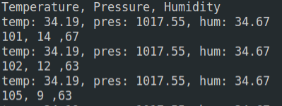

# SP_Weather 模块使用说明

[English](README.md)

## 目录结构

|  目录  | 描述           |
| :----: | :------------- |
|  doc   | 参考文档       |
|  img   | 图片           |
| script | MaixPy脚本示例 |
|  src   | C裸机程序示例  |

## 介绍

SP_Weather 拥有两颗传感器， 磁性传感器 QMC7983，这是一个内置灵敏度补偿与 NTC 的三轴磁性传感器，I2C
接口输出（最高频率 400KHz），具有出色的动态范围和精度以及超低的功耗。温湿度气压传感器 BME280，能够同时测量温湿度以及气压。可根据两颗传感器不同的器件地址来读取不同传感器的数据。

*查看[模块规格书](doc/SP-LoRa规格书V1.0.pdf)获取更多特性信息*

## 引脚图


## 接线方式


|  MCU:FUN(IO)  | SP_Weather |
| :-----------: | :--------: |
| I2C:SDA(IO_7) |    SDA     |
|   NC(IO_15)   |     NC     |
|   NC(IO_20)   |     NC     |
|   NC(IO_21)   |     NC     |
|   NC(IO_8)    |     NC     |
| I2C:SCL(IO_6) |    SCL     |
|     3.3V      |    3.3V    |
|      GND      |    GND     |

## MCU 配置

### IO 口配置

将 MCU 原理图中对应的 IO 口配置为 I2C 功能引脚。

* C 示例

  ```c
    fpioa_set_function(WEATHER_SCL, FUNC_I2C0_SCLK + WEATHER_I2C_DEVICE * 2); // WEATHER_SCL: 6;
    fpioa_set_function(WEATHER_SDA, FUNC_I2C0_SDA + WEATHER_I2C_DEVICE * 2); // WEATHER_SDA: 7;
  ```

* MaixPy 示例
    
    在 I2C 初始化中完成配置

### I2C 初始化

* C 示例

  ```c
      maix_i2c_init(WEATHER_I2C_DEVICE, 7, 400000); // WEATHER_I2C_DEVICE: 0;
  ```

* MaixPy 示例

  ```python
    i2c_bus = I2C(I2C.I2C0, freq=100*1000, scl=6, sda=7) # scl: io_6, sda: io_7
  ```

## SP_Weather 配置

### 使用方式

* 流程

  1. 初始化传感器
  2. 读取传感器数据

* C 示例

  ```c
     rslt = qmc_init(); // Magnetic sensor QMC7983 init 
     rslt = bme280_init(&dev); // Temperature, humidity and pressure sensors BME280 init 
     stream_sensor_data_normal_mode(&dev); // read and print sensor data
  ```
  
* MaixPy 示例

  ```python
    weather=SPWEATHER(i2c=i2c_bus) # create sp_weather
    weather.qmc_init() # Magnetic sensor QMC7983 init 
    weather.bme280_init() # Temperature, humidity and pressure sensors BME280 init 
    while 1:
        time.sleep_ms(500)
        print(weather.qmc_read_xyz) # QMC7983 read data
        print(weather.bme_values) # BME280 read data
  ```

## 运行环境

|  语言  |  开发板  | SDK/固件版本                   |
| :----: | :------: | :----------------------------- |
|   C    | MaixCube | kendryte-standalone-sdk v0.5.6 |
| MaixPy | MaixCube | maixpy v0.5.1                  |

## 运行结果

* C

    
* MaixPy

    

## 许可

请查看 [LICENSE](LICENSE) 文件.

## 相关信息

| 版本号 |   编辑人   |
| :----: | :--------: |
|  v0.1  | vamoosebbf |